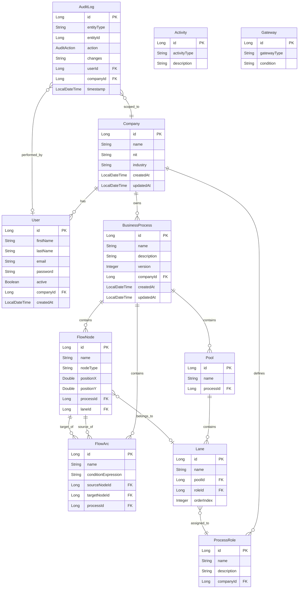
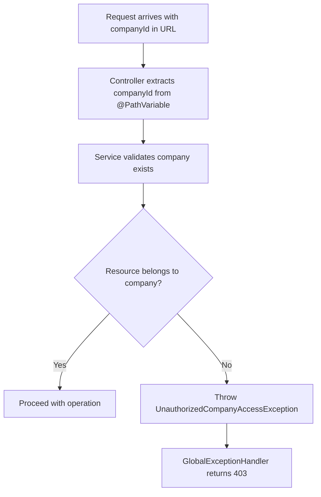
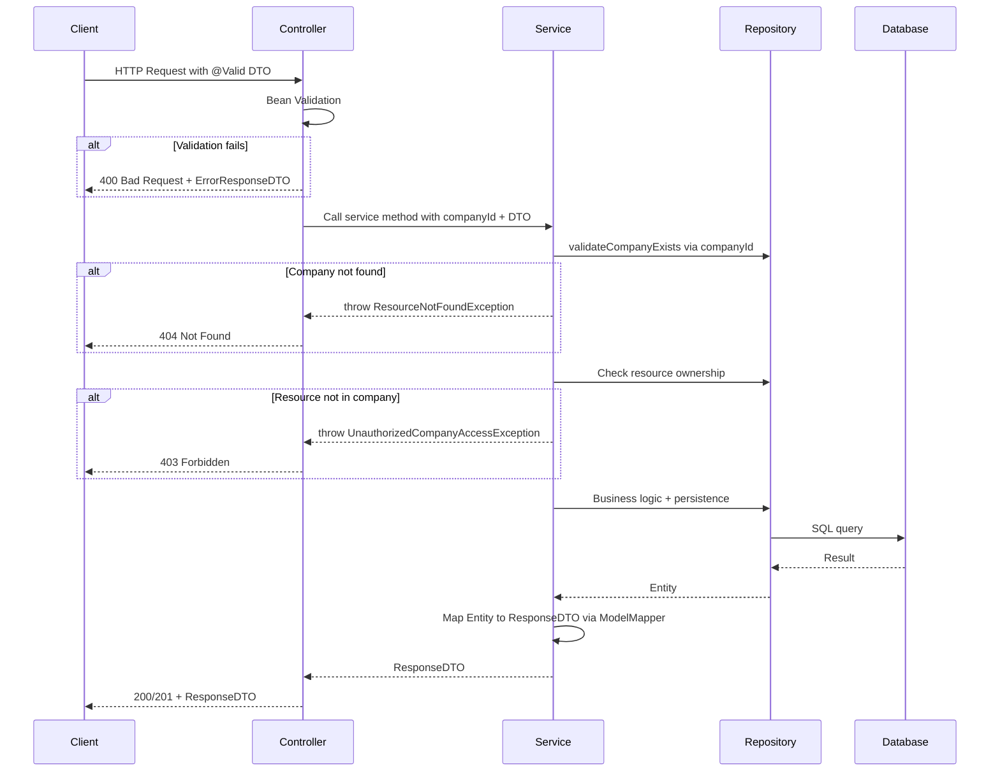

# REST API Architecture — Editor/Visor de Procesos Empresariales

## 1. Project Overview

**Multi-tenant** business process editor/viewer backend. Each `Company` has isolated `Users` and `BusinessProcesses`. The system allows **viewing and editing** processes only (no execution).

### 1.1 Current State

| Aspect | Current | Required |
|--------|---------|----------|
| Spring Boot | 4.0.2 | OK (keep) |
| Java | 21 | OK (keep; user mentioned 17, but pom says 21) |
| Thymeleaf | present | Not needed for REST API — can coexist |
| JPA / Hibernate | **missing** | Add `spring-boot-starter-data-jpa` + PostgreSQL driver |
| Lombok | **missing** | Add `lombok` dependency |
| ModelMapper | **missing** | Add `org.modelmapper:modelmapper` |
| Validation | present | OK |

### 1.2 Dependencies to Add in `pom.xml`

```xml
<!-- JPA -->
<dependency>
    <groupId>org.springframework.boot</groupId>
    <artifactId>spring-boot-starter-data-jpa</artifactId>
</dependency>
<!-- PostgreSQL driver (remote database) -->
<dependency>
    <groupId>org.postgresql</groupId>
    <artifactId>postgresql</artifactId>
    <scope>runtime</scope>
</dependency>
<!-- Lombok -->
<dependency>
    <groupId>org.projectlombok</groupId>
    <artifactId>lombok</artifactId>
    <optional>true</optional>
</dependency>
<!-- ModelMapper -->
<dependency>
    <groupId>org.modelmapper</groupId>
    <artifactId>modelmapper</artifactId>
    <version>3.2.1</version>
</dependency>
```

### 1.3 Proposed Package Structure

```
co.javeriana.dw.organizapp
├── OrganizappApplication.java
├── config/
│   └── ModelMapperConfig.java
├── controller/
│   ├── CompanyController.java
│   ├── UserController.java
│   ├── BusinessProcessController.java
│   ├── FlowNodeController.java
│   ├── FlowArcController.java
│   ├── PoolController.java
│   ├── LaneController.java
│   ├── ProcessRoleController.java
│   └── AuditLogController.java
├── dto/
│   ├── request/
│   │   ├── CompanyRequestDTO.java
│   │   ├── UserRequestDTO.java
│   │   ├── BusinessProcessRequestDTO.java
│   │   ├── ActivityRequestDTO.java
│   │   ├── GatewayRequestDTO.java
│   │   ├── FlowArcRequestDTO.java
│   │   ├── PoolRequestDTO.java
│   │   ├── LaneRequestDTO.java
│   │   └── ProcessRoleRequestDTO.java
│   └── response/
│       ├── CompanyResponseDTO.java
│       ├── UserResponseDTO.java
│       ├── BusinessProcessResponseDTO.java
│       ├── FlowNodeResponseDTO.java
│       ├── ActivityResponseDTO.java
│       ├── GatewayResponseDTO.java
│       ├── FlowArcResponseDTO.java
│       ├── PoolResponseDTO.java
│       ├── LaneResponseDTO.java
│       ├── ProcessRoleResponseDTO.java
│       ├── AuditLogResponseDTO.java
│       └── ErrorResponseDTO.java
├── entity/
│   ├── Company.java
│   ├── User.java
│   ├── BusinessProcess.java
│   ├── FlowNode.java          // @Inheritance(strategy = InheritanceType.JOINED)
│   ├── Activity.java
│   ├── Gateway.java
│   ├── FlowArc.java
│   ├── Pool.java
│   ├── Lane.java
│   ├── ProcessRole.java
│   └── AuditLog.java
├── enums/
│   ├── GatewayType.java        // EXCLUSIVE, PARALLEL, INCLUSIVE, EVENT_BASED
│   ├── ActivityType.java       // TASK, SUBPROCESS, CALL_ACTIVITY
│   ├── NodeType.java           // START_EVENT, END_EVENT, ACTIVITY, GATEWAY
│   └── AuditAction.java        // CREATE, UPDATE, DELETE
├── exception/
│   ├── GlobalExceptionHandler.java
│   ├── ResourceNotFoundException.java
│   ├── BusinessRuleException.java
│   └── UnauthorizedCompanyAccessException.java
├── repository/
│   ├── CompanyRepository.java
│   ├── UserRepository.java
│   ├── BusinessProcessRepository.java
│   ├── FlowNodeRepository.java
│   ├── FlowArcRepository.java
│   ├── PoolRepository.java
│   ├── LaneRepository.java
│   ├── ProcessRoleRepository.java
│   └── AuditLogRepository.java
└── service/
    ├── CompanyService.java
    ├── UserService.java
    ├── BusinessProcessService.java
    ├── FlowNodeService.java
    ├── FlowArcService.java
    ├── PoolService.java
    ├── LaneService.java
    ├── ProcessRoleService.java
    └── AuditLogService.java
```

### 1.4 Database Configuration

The project connects to a **remote PostgreSQL server** managed and inspected via **DBeaver**.

**Connection details:**

| Property | Value |
|----------|-------|
| Host | 190.146.2.119 |
| Port | 2345 |
| Database | grupo14 |
| User | grupo14_user |

**`application.properties`** — Spring Boot datasource configuration:

```properties
spring.application.name=organizapp

# PostgreSQL remote datasource
spring.datasource.url=jdbc:postgresql://190.146.2.119:2345/grupo14
spring.datasource.username=grupo14_user
spring.datasource.password=<password>

# JPA / Hibernate
spring.jpa.hibernate.ddl-auto=update
spring.jpa.database-platform=org.hibernate.dialect.PostgreSQLDialect
spring.jpa.show-sql=true
```

> **Note:** The database schema and tables are created by Hibernate's `ddl-auto=update` strategy. Use **DBeaver** to inspect, verify, and manually adjust the schema as needed. Avoid using `ddl-auto=create` or `create-drop` in shared environments to prevent data loss.

---

## 2. Entity Relationship Diagram



### 2.1 Entity Notes

**FlowNode Inheritance Strategy**

`FlowNode` is the base entity for `Activity` and `Gateway`. Use JPA's JOINED inheritance:

```java
@Entity
@Inheritance(strategy = InheritanceType.JOINED)
@DiscriminatorColumn(name = "node_type")
public abstract class FlowNode {
    // shared fields: id, name, nodeType, positionX, positionY, processId, laneId
}

@Entity
public class Activity extends FlowNode {
    // activityType, description
}

@Entity
public class Gateway extends FlowNode {
    // gatewayType, condition
}
```

This produces three tables: `flow_node`, `activity`, and `gateway`, joined by primary key.

> **Simplification fallback:** If JPA polymorphism becomes too complex for the first delivery, collapse into a single `FlowNode` entity with nullable columns `nodeType`, `activityType`, `gatewayType`, `condition`, and `description`. This avoids joins and `@Inheritance` altogether while preserving the same API contract.

**BusinessProcess Cascade Deletion**

Deleting a `BusinessProcess` must cascade to all child entities:

```java
@Entity
public class BusinessProcess {

    @OneToMany(mappedBy = "process", cascade = CascadeType.ALL, orphanRemoval = true)
    private List<FlowNode> flowNodes;

    @OneToMany(mappedBy = "process", cascade = CascadeType.ALL, orphanRemoval = true)
    private List<FlowArc> flowArcs;

    @OneToMany(mappedBy = "process", cascade = CascadeType.ALL, orphanRemoval = true)
    private List<Pool> pools;
}
```

The `Pool` entity cascades further to its `Lane` children using the same pattern.

---

## 3. Route Summary — All Controllers

Base path: **`/api/v1`**

### 3.1 CompanyController

| Method | Path | Description | Status Codes |
|--------|------|-------------|--------------|
| POST | `/companies` | Create a new company | 201, 400, 409 |
| GET | `/companies` | List all companies | 200 |
| GET | `/companies/{companyId}` | Get company by ID | 200, 404 |
| PUT | `/companies/{companyId}` | Update a company | 200, 400, 404, 409 |
| DELETE | `/companies/{companyId}` | Delete a company | 204, 404 |

### 3.2 UserController (scoped by company)

| Method | Path | Description | Status Codes |
|--------|------|-------------|--------------|
| POST | `/companies/{companyId}/users` | Create user in company | 201, 400, 404, 409 |
| GET | `/companies/{companyId}/users` | List users by company | 200, 404 |
| GET | `/companies/{companyId}/users/{userId}` | Get user by ID | 200, 404 |
| PUT | `/companies/{companyId}/users/{userId}` | Update user | 200, 400, 404 |
| DELETE | `/companies/{companyId}/users/{userId}` | Delete user | 204, 404 |

### 3.3 BusinessProcessController (scoped by company)

| Method | Path | Description | Status Codes |
|--------|------|-------------|--------------|
| POST | `/companies/{companyId}/processes` | Create a process | 201, 400, 404 |
| GET | `/companies/{companyId}/processes` | List processes by company | 200, 404 |
| GET | `/companies/{companyId}/processes/{processId}` | Get process by ID | 200, 404 |
| PUT | `/companies/{companyId}/processes/{processId}` | Update process metadata | 200, 400, 404 |
| DELETE | `/companies/{companyId}/processes/{processId}` | Delete process and children | 204, 404 |

### 3.4 FlowNodeController (scoped by company + process)

| Method | Path | Description | Status Codes |
|--------|------|-------------|--------------|
| POST | `/companies/{companyId}/processes/{processId}/nodes` | Create a node: activity or gateway | 201, 400, 404 |
| GET | `/companies/{companyId}/processes/{processId}/nodes` | List all nodes in process | 200, 404 |
| GET | `/companies/{companyId}/processes/{processId}/nodes/{nodeId}` | Get node by ID | 200, 404 |
| PUT | `/companies/{companyId}/processes/{processId}/nodes/{nodeId}` | Update node | 200, 400, 404 |
| DELETE | `/companies/{companyId}/processes/{processId}/nodes/{nodeId}` | Delete node and connected arcs | 204, 404 |

### 3.5 FlowArcController (scoped by company + process)

| Method | Path | Description | Status Codes |
|--------|------|-------------|--------------|
| POST | `/companies/{companyId}/processes/{processId}/arcs` | Create an arc | 201, 400, 404 |
| GET | `/companies/{companyId}/processes/{processId}/arcs` | List all arcs in process | 200, 404 |
| GET | `/companies/{companyId}/processes/{processId}/arcs/{arcId}` | Get arc by ID | 200, 404 |
| PUT | `/companies/{companyId}/processes/{processId}/arcs/{arcId}` | Update arc | 200, 400, 404 |
| DELETE | `/companies/{companyId}/processes/{processId}/arcs/{arcId}` | Delete arc | 204, 404 |

### 3.6 PoolController (scoped by company + process)

| Method | Path | Description | Status Codes |
|--------|------|-------------|--------------|
| POST | `/companies/{companyId}/processes/{processId}/pools` | Create a pool | 201, 400, 404 |
| GET | `/companies/{companyId}/processes/{processId}/pools` | List pools in process | 200, 404 |
| GET | `/companies/{companyId}/processes/{processId}/pools/{poolId}` | Get pool by ID | 200, 404 |
| PUT | `/companies/{companyId}/processes/{processId}/pools/{poolId}` | Update pool | 200, 400, 404 |
| DELETE | `/companies/{companyId}/processes/{processId}/pools/{poolId}` | Delete pool and lanes | 204, 404 |

### 3.7 LaneController (scoped by company + process + pool)

| Method | Path | Description | Status Codes |
|--------|------|-------------|--------------|
| POST | `/companies/{companyId}/processes/{processId}/pools/{poolId}/lanes` | Create a lane | 201, 400, 404 |
| GET | `/companies/{companyId}/processes/{processId}/pools/{poolId}/lanes` | List lanes in pool | 200, 404 |
| GET | `/companies/{companyId}/processes/{processId}/pools/{poolId}/lanes/{laneId}` | Get lane by ID | 200, 404 |
| PUT | `/companies/{companyId}/processes/{processId}/pools/{poolId}/lanes/{laneId}` | Update lane | 200, 400, 404 |
| DELETE | `/companies/{companyId}/processes/{processId}/pools/{poolId}/lanes/{laneId}` | Delete lane | 204, 404 |

### 3.8 ProcessRoleController (scoped by company)

| Method | Path | Description | Status Codes |
|--------|------|-------------|--------------|
| POST | `/companies/{companyId}/roles` | Create a role | 201, 400, 404, 409 |
| GET | `/companies/{companyId}/roles` | List roles by company | 200, 404 |
| GET | `/companies/{companyId}/roles/{roleId}` | Get role by ID | 200, 404 |
| PUT | `/companies/{companyId}/roles/{roleId}` | Update role | 200, 400, 404 |
| DELETE | `/companies/{companyId}/roles/{roleId}` | Delete role | 204, 404 |

### 3.9 AuditLogController (read-only, scoped by company)

| Method | Path | Description | Status Codes |
|--------|------|-------------|--------------|
| GET | `/companies/{companyId}/audit-logs` | List audit logs with filters | 200, 404 |
| GET | `/companies/{companyId}/audit-logs/{logId}` | Get single audit entry | 200, 404 |

---

## 4. Detailed Controller Designs

### 4.1 CompanyController

```java
@RestController
@RequestMapping("/api/v1/companies")
@Validated
public class CompanyController {

    private final CompanyService companyService;

    // POST /api/v1/companies
    @PostMapping
    @ResponseStatus(HttpStatus.CREATED)
    public CompanyResponseDTO create(@Valid @RequestBody CompanyRequestDTO dto);

    // GET /api/v1/companies
    @GetMapping
    public List<CompanyResponseDTO> findAll();

    // GET /api/v1/companies/{companyId}
    @GetMapping("/{companyId}")
    public CompanyResponseDTO findById(@PathVariable Long companyId);

    // PUT /api/v1/companies/{companyId}
    @PutMapping("/{companyId}")
    public CompanyResponseDTO update(@PathVariable Long companyId,
                                      @Valid @RequestBody CompanyRequestDTO dto);

    // DELETE /api/v1/companies/{companyId}
    @DeleteMapping("/{companyId}")
    @ResponseStatus(HttpStatus.NO_CONTENT)
    public void delete(@PathVariable Long companyId);
}
```

**DTOs:**

```java
// CompanyRequestDTO
@Data @NoArgsConstructor @AllArgsConstructor
public class CompanyRequestDTO {
    @NotBlank(message = "Company name is required")
    @Size(max = 100)
    private String name;

    @NotBlank(message = "NIT is required")
    @Size(max = 20)
    private String nit;

    @Size(max = 100)
    private String industry;
}

// CompanyResponseDTO
@Data @NoArgsConstructor @AllArgsConstructor
public class CompanyResponseDTO {
    private Long id;
    private String name;
    private String nit;
    private String industry;
    private LocalDateTime createdAt;
    private LocalDateTime updatedAt;
}
```

**Service: `CompanyService`**
- `CompanyResponseDTO create(CompanyRequestDTO dto)`
- `List<CompanyResponseDTO> findAll()`
- `CompanyResponseDTO findById(Long companyId)`
- `CompanyResponseDTO update(Long companyId, CompanyRequestDTO dto)`
- `void delete(Long companyId)`
- `void validateCompanyExists(Long companyId)` — reusable by all other services

**Validations:**
- NIT must be unique → 409 Conflict if duplicate
- Name must be unique → 409 Conflict if duplicate

---

### 4.2 UserController

```java
@RestController
@RequestMapping("/api/v1/companies/{companyId}/users")
@Validated
public class UserController {

    private final UserService userService;

    @PostMapping
    @ResponseStatus(HttpStatus.CREATED)
    public UserResponseDTO create(@PathVariable Long companyId,
                                   @Valid @RequestBody UserRequestDTO dto);

    @GetMapping
    public List<UserResponseDTO> findAllByCompany(@PathVariable Long companyId);

    @GetMapping("/{userId}")
    public UserResponseDTO findById(@PathVariable Long companyId,
                                     @PathVariable Long userId);

    @PutMapping("/{userId}")
    public UserResponseDTO update(@PathVariable Long companyId,
                                   @PathVariable Long userId,
                                   @Valid @RequestBody UserRequestDTO dto);

    @DeleteMapping("/{userId}")
    @ResponseStatus(HttpStatus.NO_CONTENT)
    public void delete(@PathVariable Long companyId, @PathVariable Long userId);
}
```

**DTOs:**

```java
// UserRequestDTO
@Data
public class UserRequestDTO {
    @NotBlank(message = "First name is required")
    @Size(max = 80)
    private String firstName;

    @NotBlank(message = "Last name is required")
    @Size(max = 80)
    private String lastName;

    @NotBlank(message = "Email is required")
    @Email(message = "Email must be valid")
    private String email;

    @NotBlank(message = "Password is required")
    @Size(min = 8, max = 100, message = "Password must be 8-100 characters")
    private String password;
}

// UserResponseDTO
@Data
public class UserResponseDTO {
    private Long id;
    private String firstName;
    private String lastName;
    private String email;
    private Boolean active;
    private Long companyId;
    private LocalDateTime createdAt;
    // NOTE: password is NEVER returned
}
```

**Service: `UserService`**
- `UserResponseDTO create(Long companyId, UserRequestDTO dto)`
- `List<UserResponseDTO> findAllByCompany(Long companyId)`
- `UserResponseDTO findById(Long companyId, Long userId)`
- `UserResponseDTO update(Long companyId, Long userId, UserRequestDTO dto)`
- `void delete(Long companyId, Long userId)`

**Validations:**
- Email unique per company → 409 Conflict
- Company must exist → 404
- User must belong to the specified company → `UnauthorizedCompanyAccessException`

---

### 4.3 BusinessProcessController

```java
@RestController
@RequestMapping("/api/v1/companies/{companyId}/processes")
@Validated
public class BusinessProcessController {

    private final BusinessProcessService businessProcessService;

    @PostMapping
    @ResponseStatus(HttpStatus.CREATED)
    public BusinessProcessResponseDTO create(@PathVariable Long companyId,
                                              @Valid @RequestBody BusinessProcessRequestDTO dto);

    @GetMapping
    public List<BusinessProcessResponseDTO> findAllByCompany(@PathVariable Long companyId);

    @GetMapping("/{processId}")
    public BusinessProcessResponseDTO findById(@PathVariable Long companyId,
                                                @PathVariable Long processId);

    @PutMapping("/{processId}")
    public BusinessProcessResponseDTO update(@PathVariable Long companyId,
                                              @PathVariable Long processId,
                                              @Valid @RequestBody BusinessProcessRequestDTO dto);

    @DeleteMapping("/{processId}")
    @ResponseStatus(HttpStatus.NO_CONTENT)
    public void delete(@PathVariable Long companyId, @PathVariable Long processId);
}
```

**DTOs:**

```java
// BusinessProcessRequestDTO
@Data
public class BusinessProcessRequestDTO {
    @NotBlank(message = "Process name is required")
    @Size(max = 150)
    private String name;

    @Size(max = 500)
    private String description;

    @Min(value = 1, message = "Version must be at least 1")
    private Integer version;
}

// BusinessProcessResponseDTO
@Data
public class BusinessProcessResponseDTO {
    private Long id;
    private String name;
    private String description;
    private Integer version;
    private Long companyId;
    private LocalDateTime createdAt;
    private LocalDateTime updatedAt;
    // NO nested lists of nodes/arcs — fetch those separately
}
```

**Service: `BusinessProcessService`**
- `BusinessProcessResponseDTO create(Long companyId, BusinessProcessRequestDTO dto)`
- `List<BusinessProcessResponseDTO> findAllByCompany(Long companyId)`
- `BusinessProcessResponseDTO findById(Long companyId, Long processId)`
- `BusinessProcessResponseDTO update(Long companyId, Long processId, BusinessProcessRequestDTO dto)`
- `void delete(Long companyId, Long processId)` — cascades to FlowNodes, FlowArcs, Pools, and Lanes via `CascadeType.ALL` + `orphanRemoval = true`
- `void validateProcessBelongsToCompany(Long companyId, Long processId)` — reusable

---

### 4.4 FlowNodeController

This controller handles **both** Activity and Gateway creation via a `nodeType` discriminator field.

```java
@RestController
@RequestMapping("/api/v1/companies/{companyId}/processes/{processId}/nodes")
@Validated
public class FlowNodeController {

    private final FlowNodeService flowNodeService;

    // POST — create Activity or Gateway based on nodeType
    @PostMapping
    @ResponseStatus(HttpStatus.CREATED)
    public FlowNodeResponseDTO create(@PathVariable Long companyId,
                                       @PathVariable Long processId,
                                       @Valid @RequestBody FlowNodeRequestDTO dto);

    @GetMapping
    public List<FlowNodeResponseDTO> findAllByProcess(@PathVariable Long companyId,
                                                       @PathVariable Long processId);

    @GetMapping("/{nodeId}")
    public FlowNodeResponseDTO findById(@PathVariable Long companyId,
                                         @PathVariable Long processId,
                                         @PathVariable Long nodeId);

    @PutMapping("/{nodeId}")
    public FlowNodeResponseDTO update(@PathVariable Long companyId,
                                       @PathVariable Long processId,
                                       @PathVariable Long nodeId,
                                       @Valid @RequestBody FlowNodeRequestDTO dto);

    @DeleteMapping("/{nodeId}")
    @ResponseStatus(HttpStatus.NO_CONTENT)
    public void delete(@PathVariable Long companyId,
                        @PathVariable Long processId,
                        @PathVariable Long nodeId);
}
```

**DTOs:**

```java
// FlowNodeRequestDTO — polymorphic via nodeType
@Data
public class FlowNodeRequestDTO {
    @NotBlank
    @Size(max = 100)
    private String name;

    @NotNull(message = "nodeType is required")
    private NodeType nodeType;  // START_EVENT, END_EVENT, ACTIVITY, GATEWAY

    @NotNull
    private Double positionX;

    @NotNull
    private Double positionY;

    private Long laneId; // optional, assign to a lane

    // Activity-specific fields — required only when nodeType = ACTIVITY
    private ActivityType activityType;  // TASK, SUBPROCESS, CALL_ACTIVITY
    private String description;

    // Gateway-specific fields — required only when nodeType = GATEWAY
    private GatewayType gatewayType;  // EXCLUSIVE, PARALLEL, INCLUSIVE, EVENT_BASED
    private String condition;
}

// FlowNodeResponseDTO — base response
@Data
public class FlowNodeResponseDTO {
    private Long id;
    private String name;
    private NodeType nodeType;
    private Double positionX;
    private Double positionY;
    private Long processId;
    private Long laneId;

    // Activity-specific
    private ActivityType activityType;
    private String description;

    // Gateway-specific
    private GatewayType gatewayType;
    private String condition;
}
```

**Service: `FlowNodeService`**
- `FlowNodeResponseDTO create(Long companyId, Long processId, FlowNodeRequestDTO dto)`
- `List<FlowNodeResponseDTO> findAllByProcess(Long companyId, Long processId)`
- `FlowNodeResponseDTO findById(Long companyId, Long processId, Long nodeId)`
- `FlowNodeResponseDTO update(Long companyId, Long processId, Long nodeId, FlowNodeRequestDTO dto)`
- `void delete(Long companyId, Long processId, Long nodeId)` — also deletes connected arcs

**Validations:**
- If `nodeType == ACTIVITY`, then `activityType` is required → 400
- If `nodeType == GATEWAY`, then `gatewayType` is required → 400
- `laneId` if provided must belong to the same process → 400
- Process must belong to company → `UnauthorizedCompanyAccessException`

---

### 4.5 FlowArcController

```java
@RestController
@RequestMapping("/api/v1/companies/{companyId}/processes/{processId}/arcs")
@Validated
public class FlowArcController {

    private final FlowArcService flowArcService;

    @PostMapping
    @ResponseStatus(HttpStatus.CREATED)
    public FlowArcResponseDTO create(@PathVariable Long companyId,
                                      @PathVariable Long processId,
                                      @Valid @RequestBody FlowArcRequestDTO dto);

    @GetMapping
    public List<FlowArcResponseDTO> findAllByProcess(@PathVariable Long companyId,
                                                      @PathVariable Long processId);

    @GetMapping("/{arcId}")
    public FlowArcResponseDTO findById(@PathVariable Long companyId,
                                        @PathVariable Long processId,
                                        @PathVariable Long arcId);

    @PutMapping("/{arcId}")
    public FlowArcResponseDTO update(@PathVariable Long companyId,
                                      @PathVariable Long processId,
                                      @PathVariable Long arcId,
                                      @Valid @RequestBody FlowArcRequestDTO dto);

    @DeleteMapping("/{arcId}")
    @ResponseStatus(HttpStatus.NO_CONTENT)
    public void delete(@PathVariable Long companyId,
                        @PathVariable Long processId,
                        @PathVariable Long arcId);
}
```

**DTOs:**

```java
// FlowArcRequestDTO
@Data
public class FlowArcRequestDTO {
    @Size(max = 100)
    private String name;

    @NotNull(message = "sourceNodeId is required")
    private Long sourceNodeId;

    @NotNull(message = "targetNodeId is required")
    private Long targetNodeId;

    @Size(max = 300)
    private String conditionExpression;
}

// FlowArcResponseDTO
@Data
public class FlowArcResponseDTO {
    private Long id;
    private String name;
    private Long sourceNodeId;
    private String sourceNodeName;  // denormalized for convenience
    private Long targetNodeId;
    private String targetNodeName;  // denormalized for convenience
    private String conditionExpression;
    private Long processId;
}
```

**Service: `FlowArcService`**
- `FlowArcResponseDTO create(Long companyId, Long processId, FlowArcRequestDTO dto)`
- `List<FlowArcResponseDTO> findAllByProcess(Long companyId, Long processId)`
- `FlowArcResponseDTO findById(Long companyId, Long processId, Long arcId)`
- `FlowArcResponseDTO update(Long companyId, Long processId, Long arcId, FlowArcRequestDTO dto)`
- `void delete(Long companyId, Long processId, Long arcId)`

**Validations:**
- `sourceNodeId` and `targetNodeId` must belong to the same process → 400
- `sourceNodeId != targetNodeId` (no self-loops) → 400 `BusinessRuleException`
- Duplicate arc (same source + target) → 409

---

### 4.6 PoolController

```java
@RestController
@RequestMapping("/api/v1/companies/{companyId}/processes/{processId}/pools")
@Validated
public class PoolController {

    private final PoolService poolService;

    @PostMapping
    @ResponseStatus(HttpStatus.CREATED)
    public PoolResponseDTO create(@PathVariable Long companyId,
                                   @PathVariable Long processId,
                                   @Valid @RequestBody PoolRequestDTO dto);

    @GetMapping
    public List<PoolResponseDTO> findAllByProcess(@PathVariable Long companyId,
                                                   @PathVariable Long processId);

    @GetMapping("/{poolId}")
    public PoolResponseDTO findById(@PathVariable Long companyId,
                                     @PathVariable Long processId,
                                     @PathVariable Long poolId);

    @PutMapping("/{poolId}")
    public PoolResponseDTO update(@PathVariable Long companyId,
                                   @PathVariable Long processId,
                                   @PathVariable Long poolId,
                                   @Valid @RequestBody PoolRequestDTO dto);

    @DeleteMapping("/{poolId}")
    @ResponseStatus(HttpStatus.NO_CONTENT)
    public void delete(@PathVariable Long companyId,
                        @PathVariable Long processId,
                        @PathVariable Long poolId);
}
```

**DTOs:**

```java
// PoolRequestDTO
@Data
public class PoolRequestDTO {
    @NotBlank(message = "Pool name is required")
    @Size(max = 100)
    private String name;
}

// PoolResponseDTO
@Data
public class PoolResponseDTO {
    private Long id;
    private String name;
    private Long processId;
    private Integer laneCount;  // computed field — how many lanes in this pool
}
```

**Service: `PoolService`**
- `PoolResponseDTO create(Long companyId, Long processId, PoolRequestDTO dto)`
- `List<PoolResponseDTO> findAllByProcess(Long companyId, Long processId)`
- `PoolResponseDTO findById(Long companyId, Long processId, Long poolId)`
- `PoolResponseDTO update(Long companyId, Long processId, Long poolId, PoolRequestDTO dto)`
- `void delete(Long companyId, Long processId, Long poolId)` — cascades to lanes

---

### 4.7 LaneController

```java
@RestController
@RequestMapping("/api/v1/companies/{companyId}/processes/{processId}/pools/{poolId}/lanes")
@Validated
public class LaneController {

    private final LaneService laneService;

    @PostMapping
    @ResponseStatus(HttpStatus.CREATED)
    public LaneResponseDTO create(@PathVariable Long companyId,
                                   @PathVariable Long processId,
                                   @PathVariable Long poolId,
                                   @Valid @RequestBody LaneRequestDTO dto);

    @GetMapping
    public List<LaneResponseDTO> findAllByPool(@PathVariable Long companyId,
                                                @PathVariable Long processId,
                                                @PathVariable Long poolId);

    @GetMapping("/{laneId}")
    public LaneResponseDTO findById(@PathVariable Long companyId,
                                     @PathVariable Long processId,
                                     @PathVariable Long poolId,
                                     @PathVariable Long laneId);

    @PutMapping("/{laneId}")
    public LaneResponseDTO update(@PathVariable Long companyId,
                                   @PathVariable Long processId,
                                   @PathVariable Long poolId,
                                   @PathVariable Long laneId,
                                   @Valid @RequestBody LaneRequestDTO dto);

    @DeleteMapping("/{laneId}")
    @ResponseStatus(HttpStatus.NO_CONTENT)
    public void delete(@PathVariable Long companyId,
                        @PathVariable Long processId,
                        @PathVariable Long poolId,
                        @PathVariable Long laneId);
}
```

**DTOs:**

```java
// LaneRequestDTO
@Data
public class LaneRequestDTO {
    @NotBlank(message = "Lane name is required")
    @Size(max = 100)
    private String name;

    private Long roleId;  // optional, link to a ProcessRole

    private Integer orderIndex;  // display order
}

// LaneResponseDTO
@Data
public class LaneResponseDTO {
    private Long id;
    private String name;
    private Long poolId;
    private Long roleId;
    private String roleName;  // denormalized
    private Integer orderIndex;
}
```

**Service: `LaneService`**
- `LaneResponseDTO create(Long companyId, Long processId, Long poolId, LaneRequestDTO dto)`
- `List<LaneResponseDTO> findAllByPool(Long companyId, Long processId, Long poolId)`
- `LaneResponseDTO findById(Long companyId, Long processId, Long poolId, Long laneId)`
- `LaneResponseDTO update(Long companyId, Long processId, Long poolId, Long laneId, LaneRequestDTO dto)`
- `void delete(Long companyId, Long processId, Long poolId, Long laneId)`

**Validations:**
- `roleId` if provided must belong to the same company → 400

---

### 4.8 ProcessRoleController

```java
@RestController
@RequestMapping("/api/v1/companies/{companyId}/roles")
@Validated
public class ProcessRoleController {

    private final ProcessRoleService processRoleService;

    @PostMapping
    @ResponseStatus(HttpStatus.CREATED)
    public ProcessRoleResponseDTO create(@PathVariable Long companyId,
                                          @Valid @RequestBody ProcessRoleRequestDTO dto);

    @GetMapping
    public List<ProcessRoleResponseDTO> findAllByCompany(@PathVariable Long companyId);

    @GetMapping("/{roleId}")
    public ProcessRoleResponseDTO findById(@PathVariable Long companyId,
                                            @PathVariable Long roleId);

    @PutMapping("/{roleId}")
    public ProcessRoleResponseDTO update(@PathVariable Long companyId,
                                          @PathVariable Long roleId,
                                          @Valid @RequestBody ProcessRoleRequestDTO dto);

    @DeleteMapping("/{roleId}")
    @ResponseStatus(HttpStatus.NO_CONTENT)
    public void delete(@PathVariable Long companyId, @PathVariable Long roleId);
}
```

**DTOs:**

```java
// ProcessRoleRequestDTO
@Data
public class ProcessRoleRequestDTO {
    @NotBlank(message = "Role name is required")
    @Size(max = 100)
    private String name;

    @Size(max = 300)
    private String description;
}

// ProcessRoleResponseDTO
@Data
public class ProcessRoleResponseDTO {
    private Long id;
    private String name;
    private String description;
    private Long companyId;
}
```

**Service: `ProcessRoleService`**
- `ProcessRoleResponseDTO create(Long companyId, ProcessRoleRequestDTO dto)`
- `List<ProcessRoleResponseDTO> findAllByCompany(Long companyId)`
- `ProcessRoleResponseDTO findById(Long companyId, Long roleId)`
- `ProcessRoleResponseDTO update(Long companyId, Long roleId, ProcessRoleRequestDTO dto)`
- `void delete(Long companyId, Long roleId)` — only if role not used by any lane

**Validations:**
- Role name unique per company → 409
- Cannot delete role if assigned to any lane → 409 `BusinessRuleException`

---

### 4.9 AuditLogController (read-only)

```java
@RestController
@RequestMapping("/api/v1/companies/{companyId}/audit-logs")
public class AuditLogController {

    private final AuditLogService auditLogService;

    // GET with optional query params for filtering
    @GetMapping
    public List<AuditLogResponseDTO> findAll(
            @PathVariable Long companyId,
            @RequestParam(required = false) String entityType,
            @RequestParam(required = false) Long entityId,
            @RequestParam(required = false) AuditAction action,
            @RequestParam(required = false) Long userId,
            @RequestParam(required = false) @DateTimeFormat(iso = ISO.DATE_TIME) LocalDateTime from,
            @RequestParam(required = false) @DateTimeFormat(iso = ISO.DATE_TIME) LocalDateTime to);

    @GetMapping("/{logId}")
    public AuditLogResponseDTO findById(@PathVariable Long companyId,
                                         @PathVariable Long logId);
}
```

**DTOs:**

```java
// AuditLogResponseDTO (no request DTO — read-only)
@Data
public class AuditLogResponseDTO {
    private Long id;
    private String entityType;
    private Long entityId;
    private AuditAction action;  // CREATE, UPDATE, DELETE (enum)
    private String changes;      // JSON diff or description
    private Long userId;
    private String userFullName; // denormalized
    private Long companyId;
    private LocalDateTime timestamp;
}
```

**Service: `AuditLogService`**
- `List<AuditLogResponseDTO> findAll(Long companyId, AuditLogFilterCriteria criteria)`
- `AuditLogResponseDTO findById(Long companyId, Long logId)`
- `void log(Long companyId, Long userId, String entityType, Long entityId, AuditAction action, String changes)` — called internally by other services

---

## 5. Multi-Tenancy Isolation Strategy

### 5.1 Enforcement Pattern



### 5.2 Rules

1. **Every scoped resource query** must include a `WHERE company_id = :companyId` clause (or join through a parent that does).
2. **Service layer** validates ownership before any read/write:
   - `UserService.findById(companyId, userId)` fetches the user and checks `user.getCompany().getId().equals(companyId)`
   - If mismatch → throws `UnauthorizedCompanyAccessException`
3. **Repository methods** enforce scoping via custom queries:
   ```java
   // Example in UserRepository
   List<User> findByCompanyId(Long companyId);
   Optional<User> findByIdAndCompanyId(Long id, Long companyId);
   ```
4. **Nested resources** (e.g., FlowNode inside BusinessProcess inside Company) validate the full chain:
   - Verify company exists
   - Verify process belongs to company
   - Verify node belongs to process

### 5.3 Isolation Hierarchy

```
Company
├── User             → scoped by companyId
├── ProcessRole      → scoped by companyId
├── AuditLog         → scoped by companyId
└── BusinessProcess  → scoped by companyId
    ├── FlowNode     → scoped by processId → companyId
    ├── FlowArc      → scoped by processId → companyId
    └── Pool          → scoped by processId → companyId
        └── Lane      → scoped by poolId → processId → companyId
```

---

## 6. Global Exception Handling

```java
@RestControllerAdvice
public class GlobalExceptionHandler {

    // 404 — resource not found
    @ExceptionHandler(ResourceNotFoundException.class)
    @ResponseStatus(HttpStatus.NOT_FOUND)
    public ErrorResponseDTO handleNotFound(ResourceNotFoundException ex);

    // 400 — validation errors
    @ExceptionHandler(MethodArgumentNotValidException.class)
    @ResponseStatus(HttpStatus.BAD_REQUEST)
    public ErrorResponseDTO handleValidation(MethodArgumentNotValidException ex);

    // 409 — business rule / uniqueness constraint
    @ExceptionHandler(BusinessRuleException.class)
    @ResponseStatus(HttpStatus.CONFLICT)
    public ErrorResponseDTO handleBusinessRule(BusinessRuleException ex);

    // 403 — cross-company access attempt
    @ExceptionHandler(UnauthorizedCompanyAccessException.class)
    @ResponseStatus(HttpStatus.FORBIDDEN)
    public ErrorResponseDTO handleUnauthorizedAccess(UnauthorizedCompanyAccessException ex);

    // 500 — fallback
    @ExceptionHandler(Exception.class)
    @ResponseStatus(HttpStatus.INTERNAL_SERVER_ERROR)
    public ErrorResponseDTO handleGeneral(Exception ex);
}
```

**Custom Exceptions:**

```java
// ResourceNotFoundException
public class ResourceNotFoundException extends RuntimeException {
    public ResourceNotFoundException(String resourceName, String fieldName, Object fieldValue);
    // e.g., new ResourceNotFoundException("User", "id", 42)
    // message: "User not found with id: 42"
}

// BusinessRuleException
public class BusinessRuleException extends RuntimeException {
    public BusinessRuleException(String message);
    // e.g., "Cannot delete role: it is assigned to 3 lanes"
}

// UnauthorizedCompanyAccessException
public class UnauthorizedCompanyAccessException extends RuntimeException {
    public UnauthorizedCompanyAccessException(Long companyId, String resourceName, Long resourceId);
    // message: "Resource User with id 5 does not belong to company 1"
}
```

**ErrorResponseDTO:**

```java
@Data @Builder
public class ErrorResponseDTO {
    private LocalDateTime timestamp;
    private int status;
    private String error;
    private String message;
    private Map<String, String> fieldErrors;  // for validation errors only
}
```

---

## 7. Repository Layer Summary

| Repository | Key Custom Methods |
|------------|-------------------|
| `CompanyRepository` | `existsByNit(String)`, `existsByName(String)` |
| `UserRepository` | `findByCompanyId(Long)`, `findByIdAndCompanyId(Long, Long)`, `existsByEmailAndCompanyId(String, Long)` |
| `BusinessProcessRepository` | `findByCompanyId(Long)`, `findByIdAndCompanyId(Long, Long)` |
| `FlowNodeRepository` | `findByProcessId(Long)`, `findByIdAndProcessId(Long, Long)` |
| `FlowArcRepository` | `findByProcessId(Long)`, `findByIdAndProcessId(Long, Long)`, `deleteBySourceNodeIdOrTargetNodeId(Long, Long)` |
| `PoolRepository` | `findByProcessId(Long)`, `findByIdAndProcessId(Long, Long)` |
| `LaneRepository` | `findByPoolId(Long)`, `findByIdAndPoolId(Long, Long)`, `existsByRoleId(Long)` |
| `ProcessRoleRepository` | `findByCompanyId(Long)`, `findByIdAndCompanyId(Long, Long)`, `existsByNameAndCompanyId(String, Long)` |
| `AuditLogRepository` | `findByCompanyId(Long)`, `findByCompanyIdAndEntityType(Long, String)`, various filtered queries |

All repositories extend `JpaRepository<Entity, Long>`.

---

## 8. Request Flow Diagram



---

## 9. ModelMapper Configuration

```java
@Configuration
public class ModelMapperConfig {

    @Bean
    public ModelMapper modelMapper() {
        ModelMapper mapper = new ModelMapper();
        mapper.getConfiguration()
              .setMatchingStrategy(MatchingStrategies.STRICT)
              .setSkipNullEnabled(true);
        return mapper;
    }
}
```

---

## 10. Implementation Order — Task Checklist

1. Update `pom.xml` with required dependencies (JPA, Lombok, ModelMapper, PostgreSQL driver)
2. Configure `application.properties` for the **remote PostgreSQL datasource** (see Section 1.4)
3. Verify database connectivity from Spring Boot to `190.146.2.119:2345/grupo14` and inspect schema via **DBeaver**
4. Create the package structure under `co.javeriana.dw.organizapp`
5. Implement enums: `NodeType`, `ActivityType`, `GatewayType`, `AuditAction`
6. Implement entities with JPA annotations:
   - `Company`, `User`, `BusinessProcess` (with `Integer version`, cascade to children)
   - `FlowNode` (with `@Inheritance(strategy = InheritanceType.JOINED)`), `Activity`, `Gateway`
   - `FlowArc`, `Pool`, `Lane`, `ProcessRole`
   - `AuditLog` (with `AuditAction` enum for the action field)
7. Implement custom exceptions: `ResourceNotFoundException`, `BusinessRuleException`, `UnauthorizedCompanyAccessException`
8. Implement `GlobalExceptionHandler` and `ErrorResponseDTO`
9. Implement all Request/Response DTOs
10. Implement `ModelMapperConfig`
11. Implement repositories with custom query methods
12. Implement services (start with `CompanyService`, then `UserService`, etc., following the dependency order)
13. Implement controllers (same order as services)
14. Write integration tests
